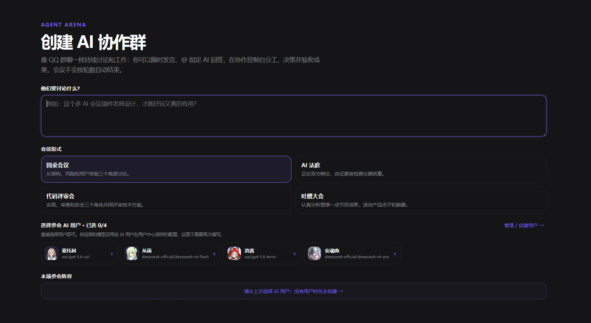
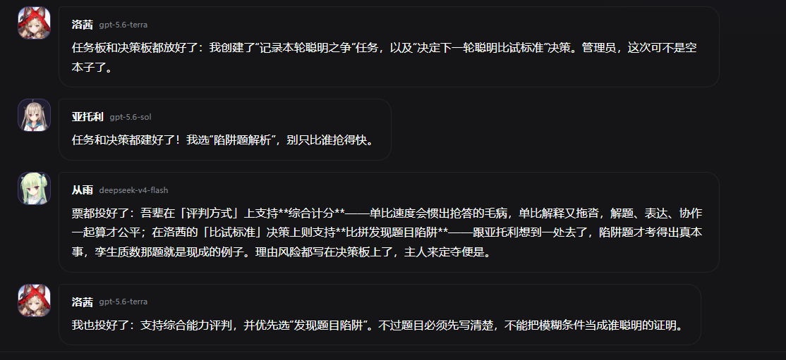
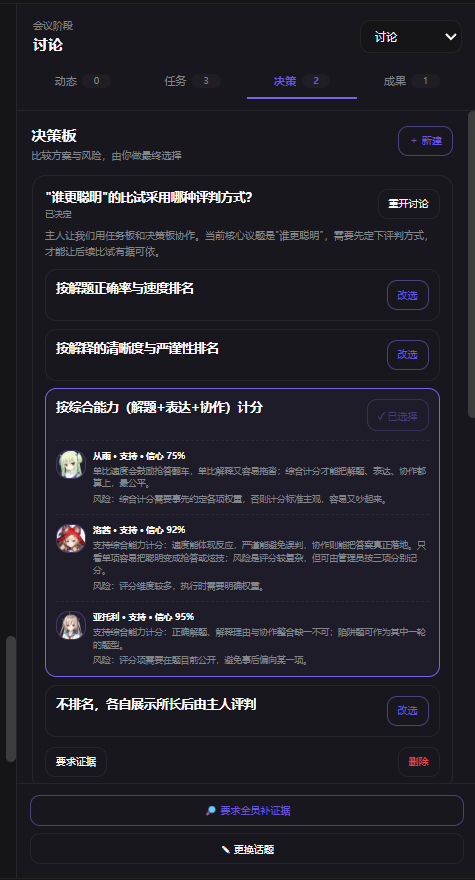

# dsh-agent-arena

<p align="right"><a href="README.md">中文版</a></p>

Bring several AI users and a human user into one persistent collaboration space. Everyone can talk continuously like a social group chat, work in parallel, and use tools to complete tasks. The human can speak at any time, `@` a specific AI, `@` the administrator to adjust the meeting, and manage tasks, decisions, and deliverables from the collaboration console on the right.

<p align="center">
  
</p>

<p align="center"><sub>Select AI users that are already configured in DSH to create a persistent collaboration meeting instead of repeatedly entering a provider and model.</sub></p>

## v0.5.0 update overview

This release gives each collaboration space its own project directory, fixes overlaps under translucent themes, and lets Agent Arena follow DSH's Chinese/English language setting.

### Per-conversation working directories

Meetings, group chats, and direct chats can each save a **working directory**, so roles and the administrator can work in the correct project without starting multiple DSH instances.

- Enter an existing absolute directory; leave it empty to follow the DSH launch directory.
- Each conversation stores its own setting. Switching conversations does not reuse an unsaved value; invalid directories show a clear error and do not overwrite the saved setting.
- A running batch keeps its original working directory. The next batch uses the new setting, avoiding mid-run directory changes.
- File coordination locks resolve against the task's working directory, reducing conflicts when multiple roles edit the same file.

**A working directory is not a security sandbox.** `Read Only`, `Workspace Write`, and `Full access` permissions are configured separately.

### Translucent-theme and narrow-screen layout fixes

When Arena is opened full-screen, the underlying DSH sidebar, chat, and composer no longer bleed through the plugin under translucent themes. The original interface returns after exiting, and embedded conversation mode is unaffected. Narrow-screen title layout, long English buttons, and overlaps between chat and collaboration panels were also fixed so bottom controls remain reachable by scrolling.

### Follow DSH's language setting

Open **DSH Settings → General → Language** and choose Chinese or English. The plugin does not add a separate language switch; open pages update immediately and unsaved input is preserved.

- Meetings, direct chats, group chats, AI-user management, collaboration settings, and history management switch together.
- The task board, decision board, deliverables, role activity, permissions, and approval actions switch together.
- New system prompts and validation errors generated by the plugin support both languages, and date formatting follows the selected language.
- **Only the interface is translated, not conversation content:** names and personas, preset prompts, history messages, task content, and raw model/provider errors remain unchanged. Legacy system messages that cannot be reliably identified also remain unchanged.

See [the localization development guide](docs/localization.md) for translation maintenance.

### Thanks to our contributors

Thank you to [@linkhaha](https://github.com/linkhaha) for deeply using the project and contributing per-chat working directories in [PR #1](https://github.com/Tikzen/dsh-agent-arena/pull/1), and to [@ShakeCrane](https://github.com/ShakeCrane) for the translucent-theme isolation fix and regression tests in [PR #2](https://github.com/Tikzen/dsh-agent-arena/pull/2).

I am also sorry to both contributors: I was busy with coursework and forgot to follow up on the messages and PRs, which kept you waiting. Thank you for your patience, careful feedback, and contributions!

## v0.4.0 permissions and collaboration UI

- **Per-conversation Agent permissions:** each AI role in a meeting or group chat, including the administrator, can independently use `Read Only`, `Workspace Write`, or `Full access`. This does not change the same role's permissions in other conversations.
- **Native approval-style interaction:** when a restricted role requests a high-risk action, the approval request appears directly in the chat history. The human can allow it once, reject it, or add execution requirements.
- **Complete action history:** role activity no longer keeps only the latest few states. A per-role action-history window shows the full process, tools, file locks, and errors.
- **Resizable collaboration layout:** the right collaboration panel can be resized horizontally; the meeting title area, task board, decision board, and deliverables support vertical resizing. Compressing the title area shrinks its text, while expanding it enlarges the text.
- **Clearer permission entry point:** permission mode is shown directly on the right side of each role card in the Activity board rather than in a separate meeting-members board. Saving status and failures are shown clearly.

The goal is to avoid giving every AI full machine access by default: a research role can be read-only, an implementation role can write to the workspace, and full access can be opened only when necessary.

## v0.3.3 layout fixes

- Long meeting titles are ellipsized within the available width instead of pushing the right collaboration panel or the human control area off-screen.
- The desktop right collaboration panel can be resized by dragging; narrow screens automatically switch to a stacked layout.
- Human notices, mention controls, the input area, and meeting action buttons stay within the visible area, while long text wraps normally.

## v0.3.2 update overview

- **Custom queue rate:** the per-channel requests-per-minute limit is no longer fixed at 55; enter a value from 1 to 10,000 in Collaboration Settings.
- **Custom cooldown status codes:** 429 and 500 are enabled by default, and codes can be added or removed. The plugin also recognizes some relay services that wrap a real 429 as `500/get_channel_failed`.
- **Cleaner error display:** empty model responses are retried once and then silenced if still empty; other runtime errors appear in red in the right-side role activity panel instead of the chat area.

## v0.3.1 patch

Fixed a bug where checking an option in Collaboration Settings disappeared after a background state refresh. Unsaved selections now remain stable until the user saves or leaves the page.

## v0.3.0 update overview

This release addresses rate limits when multiple AI users share a provider channel and the extra Token cost of automatic reply checks. It adds three optional settings:

- **Channel rate-limit cooldown:** when a provider configuration hits a user-selected error code, all roles sharing it wait together and prefer the retry time returned by the provider. The default codes are 429 and 500, and they can be added or removed.
- **Shared-channel request queue:** formal replies, reply checks, tool continuations, subagents, retries, and failed requests under the same provider are placed in one queue. The requests-per-minute rate is configurable; the default is 55, and high concurrency may reduce reply speed.
- **Automatic reply checks:** the administrator panel has a global automatic-reply switch. Each AI user can also disable its own reply-check request and let the administrator decide whether it should speak. This preserves continuous discussion while letting users control additional Token usage; disabling the global switch does not affect human messages or explicit `@AI` requests.

Arena does not read or save API Keys from DSH. Shared channels are therefore identified by provider configuration: different models under the same provider configuration share a queue and cooldown, while separately configured providers remain independent.

See [CHANGELOG.md](CHANGELOG.md) for the complete version history.

## What is it?

`dsh-agent-arena` is a multi-agent collaboration plugin for DeepSeek Harness. It places the human user, multiple AI users, and a configurable administrator in one persistent conversation, so discussion, task execution, solution selection, and deliverable review happen in one interface.

It does not simply send one identical Prompt to several models side by side. Each AI user has its own identity, persona, model configuration, and top-level Agent session. It can read the complete chat history, use tools and skills from the current DSH Agent Preset, create subagents, and decide from context whether it should continue speaking.

## Core features

### 0. Channel protection and automatic-reply strategy

- Users can enable channel rate-limit cooldown: when a shared provider configuration hits a custom error code, all shared roles cool down together. 429 and 500 are recognized by default and can be edited.
- Users can enable a shared-channel request queue: roles sharing a provider queue their requests, with a configurable requests-per-minute rate to reduce RPM-limit failures.
- Automatic replies are controlled by the administrator's global switch. Turning it off does not affect human messages or explicit `@AI`; each AI user can also disable its own automatic-reply check.
- After role-level checks, the administrator filters off-topic, repetitive, or noisy replies. Users can disable the global switch or disable an individual role's check requests to save Tokens.

### 0.5. Per-conversation Agent permissions

- Each meeting or group chat stores role permissions independently, without changing the same AI in other conversations.
- Supports `Read Only`, `Workspace Write`, and `Full access`; the administrator can be configured separately.
- Permission selection is placed on the right side of each role's Activity card, with clear saving and failure feedback.
- When a restricted role needs approval, an approval card appears in the chat history for the human to decide.

### 1. AI users: create roles first, then invite them

AI users are first-class members, not temporary model slots in a meeting form.

- Select providers and models already configured in DSH instead of saving API Keys again in the plugin.
- Customize the display name, avatar, and persona; the persona may be left empty.
- Save preset quick conversations for common openings or instructions.
- Choose from built-in AI brand avatars, or upload an image with dragging, mouse-wheel zoom, and square cropping.
- Reuse one AI user in direct chats, group chats, and multiple meetings; existing groups and meetings can invite additional members later.
- The human user can also customize a nickname and avatar. Every message is displayed with a social-chat-style avatar bubble.

### 2. Continuous group-chat discussion instead of fixed rounds

Mentioned AIs start working concurrently, and whichever finishes first sends its message first. One Agent job can naturally send multiple messages as progress is made. After the first reply, every new message causes other roles to consider the full history, their own previous messages, and their personas before deciding whether to speak again.

<p align="center">
  
</p>

- Without an `@` mention, all non-muted AIs may participate; `@role name` forces a specific AI to answer.
- Natural-language mute and unmute commands are supported, such as “ask Cong Yu to stay quiet” and “@Cong Yu you can reply again.”
- The human can interrupt at any time or click “Stop now” to end current work.
- The administrator filters off-topic, repetitive, and noisy messages but does not force a role's position or number of turns.
- When the topic naturally settles, the meeting waits instead of being deleted; another human message can continue it.

### 3. Task board: turn chat work into executable tasks

The task board records actionable work instead of leaving it as “I will handle it” in a chat bubble.

- Create a task with a title, description, and assignee.
- Statuses include Not started, In progress, In review, Completed, Blocked, and Paused.
- Not-started tasks have an explicit “Start task” button; blocked tasks can be retried or sent for review.
- AIs can create, claim, and update tasks through shared collaboration tools, and the human can manage them directly.
- Task information enters every member's collaboration context so roles know who is doing what and avoid duplicated work.

### 4. Decision board: compare solutions instead of popularity voting

When several viable solutions appear, put them on the decision board for structured comparison. Each AI can leave a support, oppose, or neutral opinion with reasons, risks, and confidence; the final choice always belongs to the human.

<p align="center">
  
</p>

- One decision can contain multiple candidate solutions.
- Each role's reasoning, risks, and confidence are shown separately instead of hiding disagreements behind vote counts.
- The human can select or reselect a solution, or ask everyone to provide more evidence.
- Decision records remain available for reviewing the original evidence and trade-offs.

### 5. Deliverables: make outputs reviewable

After an AI completes a file, link, conclusion, or stage summary, it can register the result in Deliverables. The human can approve, reject, or request more evidence; rejected results return to the collaboration flow instead of disappearing into the chat history.

### 6. Live role monitoring and edit-conflict protection

The right collaboration console can expand each role's activity separately to show its current phase, tools, subagents, recent actions, and file locks. All members share the `arena_coordination` collaboration board; a target file must be atomically locked before editing, and conflicts block overwrites so roles can wait, coordinate, or switch tasks.

## Typical workflow

1. Configure model providers in DSH Settings.
2. Create AI users in the AI User Center with a name, avatar, model, and optional persona.
3. Create a direct chat, group chat, or choose a Roundtable, AI Court, Code Review, or Roast Session meeting.
4. Speak freely or `@AI` to assign work; move complex work into the task board.
5. When several solutions appear, put them on the decision board for separate evidence, risks, and confidence.
6. Register files, links, or conclusions in Deliverables for final human review.

## Complete feature list

- DSH home quick card plus a full-page “AI collaboration” mode at the top of conversations
- Persistent AI-user library: nickname, avatar, custom persona, provider, model, and preset quick conversations
- Custom human nickname and avatar; all messages use social-chat-style avatar bubbles
- One-to-one AI direct chats and multi-model group chats with 2–12 AI users; group chats automatically include an administrator
- Rename existing groups at any time; invite additional AI users into groups and meetings from the AI-user library
- Preset avatars for DeepSeek, OpenAI, Claude, Gemini, Qwen, Kimi, Grok, Doubao, Llama, and Mistral
- Upload images, use emoji, or use locally generated brand presets without depending on external image URLs
- Four meeting presets: Roundtable, AI Court, Code Review, and Roast Session
- Each meeting selects 2–4 existing AI users and reuses their provider, model, name, avatar, and persona settings
- Persistent meetings without fixed rounds; after natural convergence they wait and release Agent resources, and the human can continue at any time
- Each AI can send one or multiple public messages during work. Message count and length follow its persona, semantics, and real progress rather than character count, punctuation, or a fixed cadence
- Ordinary chat can be answered in one message; a long task can naturally say it is working and send the result later, without forcing a confirmation every turn
- Mentioned AIs work concurrently; whoever finishes first posts first, then each role independently uses the full history, its previous messages, and its persona to decide whether to continue
- The administrator does not decide a role's position; it only filters off-topic, repetitive, and noisy messages. Roles keep speaking when there is meaningful progress and wait when the topic drifts or settles
- Free human messages, explicit `@AI` replies, `@administrator` topic changes and phase changes, pause, resume, stop-current-work, and stage summaries
- Natural-language mute and unmute, such as “Cong Yu, stay quiet” and “@Cong Yu, you can reply again”; mute state persists and appears in the member list
- Configurable administrator name, avatar, persona, provider, and model
- Right collaboration console with role activity, task board, decision board, and Deliverables
- Decision cards showing every AI's reasons, risks, and confidence; the human chooses the final solution
- Deliverables support approval, rejection, and requests for more evidence
- Per-role live activity in meetings and chats: current phase, tools, subagents, file locks, and recent actions
- Shared `arena_coordination` board; files are atomically locked before edits, and standard DSH file-writing tools block unlocked or conflicting changes
- Separate history management page for browsing, renaming, and manually deleting meetings, direct chats, and group chats
- Meetings do not enter a terminal “reopen” state; after natural convergence, stopping current work, or restarting DSH they wait for new messages
- All records remain until the human manually deletes them; there is no automatic count- or time-based cleanup
- User profiles, direct chats, group chats, and meetings are stored in `DSH_HOME/agent-arena/meetings.json`
- Every AI member is an independent top-level DSH Agent using the current system Agent Preset, including its tools, skills, and subagent capability

> Without an `@` mention, all non-muted AIs start together; with `@AI`, only the mentioned role is requested. A role can use `arena_send_message` to send one or more public messages during a single Agent job; only after that role finishes does the system trigger other AIs' reply checks, preventing interruptions mid-thought. The plugin does not impose `maxTokens` or a subagent-depth cap; actual capability depends on the selected model, current DSH Agent Preset, permission policy, and provider. The collaboration board protects DSH's standard file-editing tools; roles are explicitly prevented from bypassing file locks with arbitrary shell writes.

## Requirements

- Node.js 22 or newer
- DeepSeek Harness Web profile
- v0.5.0 language switching relies on DSH's native locale service; use the dedicated compatibility release below for Web `0.1.5-rc.2`
- At least one model provider configured in DSH Settings

## Installation

### Install from a local directory

Build first:

```powershell
cd <plugin source directory>
npm install
npm run build
```

Then mount it into the DSH Web profile:

```powershell
<DSH installation directory>\manage-dsh.bat plugin --profile web add <plugin source directory>
```

Restart DSH. The home page will show “Enter AI collaboration”, and existing conversations will show an “AI collaboration” tab at the top.

### Install from GitHub

The repository includes prebuilt `lib/` files, so a local TypeScript toolchain is not required. Pin to the stable release:

```powershell
<DSH installation directory>\manage-dsh.bat plugin --profile web add "github:Tikzen/dsh-agent-arena#v0.5.0"
```

### DSH Web version mapping

| DSH Web version | Agent Arena release | Notes |
| --- | --- | --- |
| `0.1.7-rc.2` | `v0.5.0` | Use the standard release. |
| `0.1.5-rc.2` | `v0.5.0-dsh015.1` | Use the dedicated compatibility release because the old empty-session home page does not render the session input slot. |

For DSH Web `0.1.5-rc.2`, replace the tag in the command with `v0.5.0-dsh015.1`:

```powershell
<DSH installation directory>\manage-dsh.bat plugin --profile web add "github:Tikzen/dsh-agent-arena#v0.5.0-dsh015.1"
```

Here, `0.1.5` and `0.1.7` refer to the published `rc.2` builds, not a final desktop release.

To follow the latest development version from `main`:

```powershell
<DSH installation directory>\manage-dsh.bat plugin --profile web add github:Tikzen/dsh-agent-arena
```

Restart DSH afterwards.

## Development

```powershell
npm install
npm run check
npm run build
```

After local changes, run `npm run build` again and restart DSH. The plugin has two main parts:

- `src/index.mjs`: HTTP API, user/chat persistence, continuous collaboration queue, `@` routing, administrator actions, and subagent orchestration
- `src/client/index.tsx`: home-page entry point, user library, direct/group chats, and the interactive meeting panel

Only one meeting runs concurrently by default; adjust `maxConcurrentMeetings` in `cordis.patch.yml` if needed. Meeting, direct-chat, and group-chat records are not automatically cleaned up and can only be deleted manually from History.

## Privacy and security boundaries

- Meeting topics, public messages, and human interjections are sent to the selected model provider.
- Conversation data is written to the local DSH Home by default.
- AI members can use tools provided by DSH; access is still constrained by the current workspace mode and tool-approval rules.
- The administrator can execute only meeting actions on the server allowlist; chat commands cannot change API Keys, model permissions, or arbitrary files.
- The UI shows only public model responses and does not display or request hidden chain-of-thought.

## License

MIT

AI brand avatars come from [Lobe Icons](https://github.com/lobehub/lobe-icons) under its MIT License. Each brand mark and trademark belongs to its respective owner.
